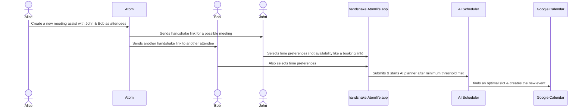

# Atom: Your Open-Source Superpowered Siri/Alexa (AI assistant) for Enhanced Productivity

Atom is a powerful and flexible open-source AI assistant designed to streamline your workflow, intelligently manage your schedule, automate research, and organize your information. Take control of your productivity with an assistant that you can host yourself, ensuring privacy and customization.

## Why Choose Atom?
*   **Empower Your Productivity:** Let Atom handle the tedious tasks of scheduling, note-taking, and information gathering so you can focus on what matters most.
*   **Open Source & Transparent:** Built with transparency in mind, Atom's open-source nature means you have full visibility into its operations. No black boxes.
*   **Self-Hosted for Privacy & Control:** Host Atom on your own infrastructure for maximum privacy and control over your data and how the assistant operates.
*   **Highly Customizable:** Adapt Atom to your specific needs. Its modular design and open codebase allow for extensive customization and integration possibilities.
*   **Intelligent Automation:** Leverage AI for smart scheduling that considers your preferences, automated event templating, and efficient research capabilities.
*   **Seamless Integrations:** Connect Atom with your favorite tools like Google Calendar, Notion, Slack, Zoom, and more to create a unified productivity hub.

## Table of Contents
- [Why Choose Atom?](#why-choose-atom)
- [Example Use Cases](#example-use-cases)
- [Documentation](#documentation)
- [Features](#features)
- [Core Agent Capabilities & Commands](#core-agent-capabilities--commands)
- [Configuration (Environment Variables)](#configuration-environment-variables)
- [Diagram](#diagram)
  - [Meeting Assist](#meeting-assist)
- [Deployment Options](#deployment-options)
  - [Local Docker Compose](#local-docker-compose)
  - [AWS Cloud Deployment (Self-Hosted)](#aws-cloud-deployment-self-hosted)
- [Support the Project](#support-the-project)
- [Contributing](#contributing)
- [New Use Cases](./NEW_USE_CASES.md)

## Example Use Cases
Tired of juggling multiple apps and struggling to stay organized? Atom is here to help you reclaim your focus and boost your productivity. Here are a few ways Atom can simplify your work and personal life:

*   **Effortless Meeting Coordination:** "Find a time next week for a 30-minute meeting with Sarah and John, prioritizing Wednesday afternoon." Atom will check everyone's availability (integrating with their calendars if permitted) and propose optimal times.
*   **Smart Task Management (Voice-Powered):** Use natural voice commands like "Atom, create a task: follow up with marketing by Friday" or "Atom, what are my tasks for today?" Atom manages these tasks in a dedicated Notion database you configure.
*   **Automated Information Gathering:** "Research the latest trends in AI-powered personal assistants and summarize the key findings in a Notion document." Atom's research agents can browse, collect, and synthesize information, delivering it directly to your knowledge base.
*   **Voice-Powered Note-Taking:** While commuting, you can say: "Atom, take an audio note: Idea for marketing campaign - focus on social media engagement and influencer collaborations." Atom will transcribe the audio and save it to Notion.
*   **Automated Meeting Summaries & Action Items:** Atom can process your meeting transcripts (e.g., from live meeting attendance or uploaded recordings) and then automatically extract key decisions and action items directly into your Notion meeting notes.
*   **Intelligent Information Retrieval:** Ask Atom "What did we decide about Project X?" or "Search my meetings for discussions on marketing strategy." Atom can semantically search through your transcribed meeting archives (stored in Notion & LanceDB) to find relevant information quickly.
*   **Proactive Schedule Optimization:** With Autopilot, Atom can learn your work patterns and preferences. "My mornings are for deep work. Keep them as free of meetings as possible." Atom will then intelligently schedule new events accordingly.
*   **LLM-Powered Scheduling:** "Find a time for a 30-minute meeting with Sarah and John to discuss the Q3 marketing plan." Atom will use a large language model to parse your request and then find an optimal time for the meeting.
*   **Quickly Access Information:** "What was the outcome of the Project Phoenix meeting last month?" Atom can search your linked Notion notes and relevant event details to provide you with the context you need.
*   **Stay on Top of Your Day:** "What's on my agenda for today?" or "Do I have any free time this afternoon for a quick call?"
*   **Proactive Meeting Prep:** "Atom, get me ready for my meeting with 'Project X'." Atom gathers related notes, emails, and tasks.
*   **Weekly Review & Preview:** "Atom, what's my weekly digest?" Atom summarizes completed tasks, key meetings, and highlights upcoming critical items.
*   **Intelligent Follow-ups:** After a meeting, ask "Atom, what follow-ups for the 'Project X' meeting?" Atom analyzes notes/transcripts for actions, decisions, and questions.

## Documentation

For comprehensive information about Atom, including setup, deployment, and features, please refer to the following guides:

*   **[Features Overview](./FEATURES.md):** A detailed list and explanation of all of Atom's capabilities.
*   **[Docker Compose Deployment](./atomic-docker/README.md):** Instructions for setting up and running Atom locally using Docker Compose.
*   **[AWS Cloud Deployment](./deployment/aws/README.md):** A guide for deploying Atom to your own AWS account for a scalable, self-hosted solution.
*   **[Technical Documentation](./atomic-docker/docs/):** Additional technical details, API guides, and development information.

## Features

Atom is equipped with a powerful suite of features to streamline your productivity:

*   **AI-Powered Scheduling:** Smartly manages your calendar with AI-driven event matching, automated tagging, and customizable templates.
*   **Voice-Powered Task Management:** Use natural language to create, query, and update tasks in Notion.
*   **Integrated Notes & Research:** Take notes via text or audio, and leverage a multi-agent system for automated research.
*   **Semantic Search:** Instantly find information across your meeting transcripts and notes.
*   **Live Meeting Assistance:** Atom can join meetings, provide real-time transcription, and extract action items.
*   **Proactive Assistance:** Get automated weekly digests, smart meeting preparation, and intelligent follow-up suggestions.

For a comprehensive list of all features and capabilities, please see our **[Features Overview Document](./FEATURES.md)**.

## Core Agent Capabilities

Interact with Atom's AI agent via a chat interface to manage your productivity across various services. The agent's enhanced Natural Language Understanding (NLU) allows you to:

*   **Manage Calendars:** Create, list, and modify events in Google Calendar and Microsoft Teams.
*   **Handle Tasks in Notion:** Use natural language to create, query, and update tasks in your Notion database.
*   **Search Your Knowledge Base:** Perform semantic searches across meeting transcripts and notes.
*   **Control Integrations:** Send Slack messages, manage Zoom meetings, handle HubSpot contacts, and much more.
*   **Automate Workflows:** Initiate research projects, get weekly digests, and receive suggestions for meeting follow-ups.

For a complete list of integrations and agent capabilities, see the **[Features Overview Document](./FEATURES.md)**.

## Configuration

Atom is configured using environment variables. For a complete and detailed list of all required and optional variables, please consult the `.env.example` file located in the `atomic-docker/project/` directory.

Specific setup instructions and variable explanations for each deployment method can be found in their respective guides:
*   **[Docker Compose Deployment Guide](./atomic-docker/README.md)**
*   **[AWS Cloud Deployment Guide](./deployment/aws/README.md)**

## Diagram

### Meeting Assist

## Deployment Options

Atom offers two primary methods for deployment, giving you the flexibility to choose between a simple local setup or a scalable cloud solution.

### Local Docker Compose

Run Atom on a single machine for local development, testing, or small-scale self-hosting. This method uses Docker Compose to orchestrate all the necessary services.

*   **Setup and Instructions:** See the **[Docker Compose Deployment Guide](./atomic-docker/README.md)**.

### AWS Cloud Deployment (Self-Hosted)

Deploy the entire application stack to your own AWS account for a robust, scalable, and private cloud environment. This deployment is managed by the AWS Cloud Development Kit (CDK) and leverages AWS managed services for optimal performance and reliability.

*   **Setup and Instructions:** See the **[AWS Cloud Deployment Guide](./deployment/aws/README.md)**.

### Web Version

The web version of Atom is available at [https://github.com/rush86999/atom/tree/main/atomic-docker/app_build_docker](https://github.com/rush86999/atom/tree/main/atomic-docker/app_build_docker).

## Support the Project
- I'm spending 100% of my work time on this project
- Star this repository, so I can start an Open Collective to support this project
- In process of setting up Github Sponsors
- Follow me on Twitter: https://twitter.com/rish1_2
- Used Atom? write a review or let me know!

## Contributing

1. Fork this repository and clone the fork to your machine
2. Create a branch (`git checkout -b my-new-feature`)
3. Implement a new feature or fix a bug and add some tests or proof of fix
4. Commit your changes (`git commit -am 'Added a new feature'`)
5. Push the branch to your fork on GitHub (`git push origin my-new-feature`)
6. Create new Pull Request from your fork

## New Use Cases

By combining multiple integrations, Atom can automate complex workflows and provide you with a powerful set of tools to manage your work and personal life. For more detailed information, please see our [New Use Cases Document](./NEW_USE_CASES.md).

*   **Proactive Project and Team Health Monitoring:** Monitor a project's health by combining data from project management, version control, communication, and calendar tools.
*   **Automated Competitor Analysis:** Automatically gather and analyze information about competitors from a variety of sources.
*   **Personalized Learning Assistant:** Create a personalized learning plan for the user based on their interests and learning history.