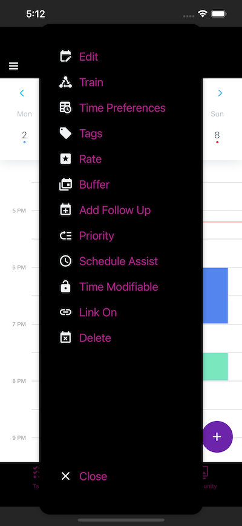
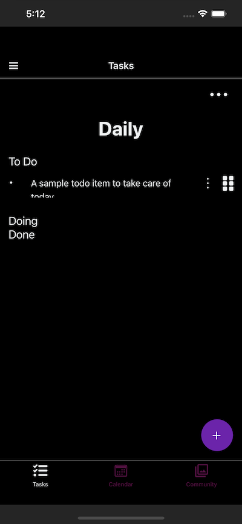
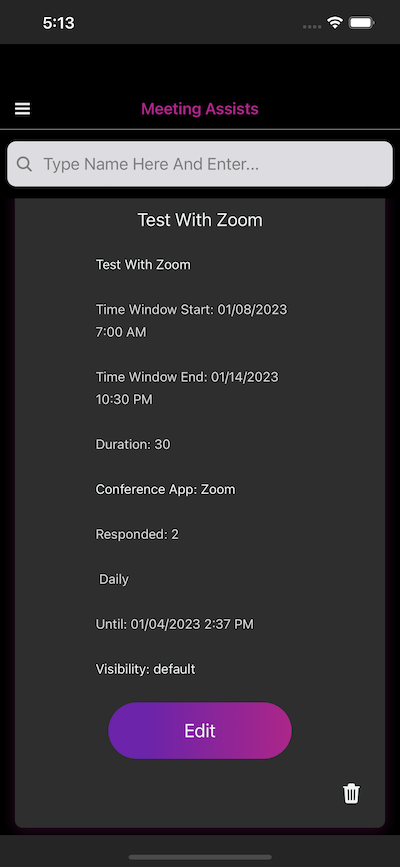

    

<h1 align="center">Atomic - Self Hosted Open Source Alternative to Clockwise & Motion</h1>

      

## Disclaimer
- ⚠️ Project is under active development
- ⚠️ `console.log.*$` regex was introduced to remove console logs. Code needs to be edited for side effects. Your IDE should be able to catch most of these or you can wait for an update

## Table of Contents

## Documentation

- You can find documentation on how to use Atomic at https://docs.atomiclife.app
- Installation for this repo is based on following the README.md files for each directory to completely install Atomic on your own servers
- The installation process will take some time. Consider reserving a few hours for any trouble shooting
- [Hasura](https://hasura.io/) connected to a Postgresql database is required to store data
- [Amplify](https://docs.amplify.aws/) is used for authentication, parts of storage, database
- [Serverless Framework](https://www.serverless.com/framework/docs) is used for part of a serverless backend

## Demo

You can see a demo video at https://www.atomiclife.app

## Features

| Feature | Description |
| ----------- | ----------- |
| Semantic search | Use unique key phrases to match semantically similar past task events and apply them to new ones. Now your past tasks are templates for new ones! Apply duration, color, time preferences, priority, tags and more. Note: You need to "train" Atomic on existing events to create event templates for new events. Read the [docs](https://docs.atomiclife.app) for more info. |
| Automated tagging | Apply tags automatically using an AI model used for classification. Each tag comes with its own set of settings configured to apply to all matched events |
| Flexible Meetings | Create recurring 1:1's or ad hoc team meetings that works with everyone's schedule. Every attendee's calendar is taken into account. Non-Atomic users can also sync their calendars and submit their time preferences. Once setup, your flexible recurring meetings occur automagically conflict free based on your time preferences.|
| Autopilot | You can run the AI planner on Autopilot that will also search & apply features to new events based on past trained event templates. The AI planner will always run before your work day starts |
|Time Preferences |Select time preferences for flexible meetings and other modifiable events |
| Train events| You can train existing events and make them templates for new ones. Attributes you can change include transparency, buffer times, priority, time preferences, modifiable nature, tags, color, duration, break type, alarms. You can also "untrain" by turning "link off" in the event menu options.|
| Time Blocking | You can automate time blockings of tasks that have a daily or weekly deadline with priority to let Atomic place them in the right place on your calendar. The deadlines can be soft or hard based on your requirements.|
|Priority | You can set priority to modifiable events. Priority of 1 is neutral. 1 has no impact on the AI planner's decision making process. Any number > 1 will impact sooner it appears on the calendar relative other high priority events.|
|Rating| You can rate events to tell Atomic how productive you were for the time block. Next run, Atomic will take it into consideration before the placing the event if it's modifiable|
| Smart Tags | You can apply settings to tags. These settings will tell Atomic how to apply features or attributes to new events that are tagged by the AI model or manually.|

#### Benefits of Self Hosted
- Privacy enabled by default
- Customizable - adjust any parameters to make it work to your requirements

### Cloud Hosted Atomic
- Prioritized version
- Full customer support & bug fixes
- Road map
  - SSO for teams
  - Microsoft Outlook Calendar integration
  - ChatGPT integration for Premium version
  
### Customize Atomic for your team on your cloud
- Same level of support & features as cloud hosted version
- Same features
- 1 year support included
- $15 / month support afterwards

## Support the Project
- I'm spending 100% of my work time on this project
- I'm planning a kickstarter project to open source more features on the road map. Subscribe to my [newsletter](https://atomiclifeapp.substack.com/?r=223v8l&utm_campaign=pub&utm_medium=web) where I will notify you when it kicks off
  - Get exclusive early access to new features for supporting the project
- Star this repository, so I can start an Open Collective to support this project
- In process of setting up Github Sponsors
- Follow my public roadmap at https://changemap.co/atomic-life/atomic/. Note: kickstarter campaign will determine feature priority. If you will be supporting the campaign make sure to upvote features you want on the public roadmap.
- Subscribe to my cloud hosted version so I can keep this project alive (currently in beta and not being charged yet)
- Follow me on Twitter: https://twitter.com/rish1_2

# atomic
