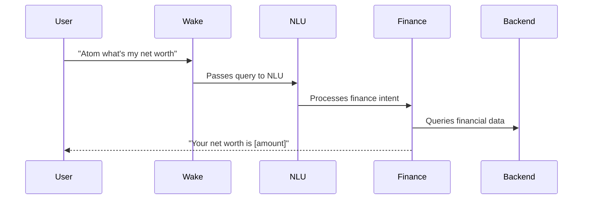

# Atom: Your Open-Source Superpowered Siri/Alexa (AI assistant)

Atom is a powerful and flexible open-source AI assistant designed to streamline your workflow, intelligently manage your schedule, automate research, and organize your information. Take control of your productivity with an assistant that you can host yourself, ensuring privacy and customization.

## Why Choose Atom?
*   **Empower Your Productivity:** Let Atom handle schedules, finances, notes, and communications so you can focus on what matters.
*   **Open Source & Transparent:** Full visibility into operations - no black boxes.
*   **Self-Hosted Privacy & Control**: Host on your infrastructure for maximum privacy.
*   **Finance, Money & Budgeting**: Complete finance suite with Plaid banking integration and wake word "Atom" for natural language queries - net worth, budgets, spending analysis, goals, investments, and secure transaction search via Gmail email receipts.
*   **Communication & CRM**: Voice-enabled customer relationship management across emails, Slack, Teams, and social media.
*   **Voice-First Interface**: "Atom show my net worth" or "Atom schedule a meeting" - works after wake word detection.
*   **Highly Customizable:** Extensible design for your specific needs.
*   **Seamless Integrations:** Connected finance (banks, investments), communication tools, calendars and research capabilities.

## Table of Contents
- [Why Choose Atom?](#why-choose-atom)
- [Example Use Cases](#example-use-cases)
- [Comprehensive Use Cases](./USE_CASES.md)
- [Documentation](#documentation)
- [Features](#features)
- [Core Agent Capabilities](#core-agent-capabilities)
- [Configuration](#configuration)
- [Diagram](#diagram)
- [Deployment Options](#deployment-options)
  - [Local Docker Compose](#local-docker-compose)
  - [AWS Cloud Deployment (Self-Hosted)](#aws-cloud-deployment-self-hosted)
- [Support the Project](#support-the-project)
- [Contributing](#contributing)

## Example Use Cases
Tired of juggling multiple apps and struggling to stay organized? Atom is here to help you reclaim your focus and boost your productivity. Here are a few ways Atom can simplify your work and personal life:

*   **Effortless Meeting Coordination:** "Find a time next week for a 30-minute meeting with Sarah and John, prioritizing Wednesday afternoon." Atom will check everyone's availability (integrating with their calendars if permitted) and propose optimal times.
*   **Smart Task Management (Voice-Powered):** Use natural voice commands like "Atom, create a task: follow up with marketing by Friday" or "Atom, what are my tasks for today?" Atom manages these tasks in a dedicated Notion database you configure.
*   **Automated Information Gathering:** "Research the latest trends in AI-powered personal assistants and summarize the key findings in a Notion document." Atom's research agents can browse, collect, and synthesize information, delivering it directly to your knowledge base.
*   **Voice-Powered Note-Taking:** While commuting, you can say: "Atom, take an audio note: Idea for marketing campaign - focus on social media engagement and influencer collaborations." Atom will transcribe the audio and save it to Notion.
*   **Automated Meeting Summaries & Action Items:** Atom can process your meeting transcripts (e.g., from live meeting attendance or uploaded recordings) and then automatically extract key decisions and action items directly into your Notion meeting notes.
*   **Intelligent Information Retrieval:** Ask Atom "What did we decide about Project X?" or "Search my meetings for discussions on marketing strategy." Atom can semantically search through your transcribed meeting archives (stored in Notion & LanceDB) to find relevant information quickly.
*   **Proactive Schedule Optimization:** With Autopilot, Atom can learn your work patterns and preferences. "My mornings are for deep work. Keep them as free of meetings as possible." Atom will then intelligently schedule new events accordingly.
*   **LLM-Powered Scheduling:** "Find a time for a 30-minute meeting with Sarah and John to discuss the Q3 marketing plan." Atom will use a large language model to parse your request and then find an optimal time for the meeting.
- **Comprehensive Finance Management:** Wake word activated finance commands via Plaid banking: "Atom what's my net worth today?" gives complete financial overview including secure bank connections, "Atom show my dining budget" displays budget analysis, "Atom where did I spend most money this month?" provides spending insights across categories, "Atom create emergency fund goal for $5000" sets up goal tracking, "Atom find Amazon purchases over $75" combines bank transactions and Gmail receipt search.
- **Quickly Access Information:** "What was the outcome of the Project Phoenix meeting last month?" Atom can search your linked Notion notes and relevant event details to provide you with the context you need.
- **Stay on Top of Your Day:** "What's on my agenda for today?" or "Do I have any free time this afternoon for a quick call?"
- **Proactive Meeting Prep:** "Atom, get me ready for my meeting with 'Project X'." Atom gathers related notes, emails, and tasks.
- **Weekly Review & Preview:** "Atom, what's my weekly digest?" Atom summarizes completed tasks, key meetings, and highlights upcoming critical items.
- **Intelligent Follow-ups:** After a meeting, ask "Atom, what follow-ups for the 'Project X' meeting?" Atom analyzes notes/transcripts for actions, decisions, and questions.
- **Banking Integration**: Complete financial management with bank account connections, budget tracking, and intelligent spending insights.

## Documentation

For comprehensive information about Atom, including setup, deployment, and features, please refer to the following guides:

*   **[Features Overview](./FEATURES.md):** A detailed list and explanation of all of Atom's capabilities.
*   **[Docker Compose Deployment](./atomic-docker/README.md):** Instructions for setting up and running Atom locally using Docker Compose.
*   **[AWS Cloud Deployment](./deployment/aws/README.md):** A guide for deploying Atom to your own AWS account for a scalable, self-hosted solution.
*   **[Technical Documentation](./atomic-docker/docs/):** Additional technical details, API guides, and development information.

## Features

Atom is a powerful and flexible open-source AI assistant with a wide range of features, including:

*   **Conversational AI Agent:** Interact with Atom through a chat interface to manage tasks, schedule meetings, get information, and control integrations.
*   **Wake Word Detection:** Initiate interaction with Atom using a spoken wake word (e.g., "Atom") for hands-free operation.
*   **Smart Meeting Preparation:** Proactively gathers relevant notes, emails, and tasks for your upcoming meetings.
*   **Automated Weekly Digest:** Provides a summary of your accomplishments and critical upcoming items.
*   **Comprehensive Integrations:** Atom supports a wide range of third-party integrations, including:
    *   **Communication:** Gmail, Outlook, Slack, Microsoft Teams
    *   **Scheduling:** Google Calendar, Outlook Calendar, Calendly, Zoom
    *   **Task Management:** Notion, Trello, Asana, Jira
    *   **File Storage:** Google Drive, Dropbox, OneDrive, Box
    *   **Finance:** Plaid, Quickbooks, Xero, Stripe
    *   **CRM & Sales:** Salesforce, HubSpot
    *   **Social Media:** Twitter, LinkedIn, Instagram, TikTok
    *   **Marketing:** Mailchimp, Canva, Figma
    *   **HR:** Greenhouse, BambooHR
    *   **E-commerce:** Shopify
    *   **Other:** Zapier, Zoho, DocuSign

For a complete list of all features and capabilities, please see our **[Features Overview Document](./FEATURES.md)**.

## Core Agent Capabilities

Atom's agent is equipped with a wide range of skills that allow it to perform various tasks and interact with different services, including:

*   **Calendar:** Manage your calendar, schedule meetings, and create events.
*   **Email:** Read, send, and search your emails.
*   **Contacts:** Manage your contacts and find contact information.
*   **Tasks:** Create, query, and update your tasks.
*   **Notes:** Create and manage your notes.
*   **Reminders:** Set and manage your reminders.
*   **Autopilot:** Proactively manages your schedule by applying learned features and templates.
*   **Browser:** Control a web browser to perform tasks like navigating to a URL, clicking on elements, and extracting text.
*   **Finance:** Manage your finances, track your spending, and create budgets.
*   **Research:** Research and gather information from various sources.
*   **Social Media:** Manage your social media accounts and track your social media presence.

For a complete list of integrations and agent capabilities, see the **[Features Overview Document](./FEATURES.md)**.

## Configuration

Atom is configured using environment variables. For a complete and detailed list of all required and optional variables, please consult the `.env.example` file located in the `atomic-docker/project/` directory.

Specific setup instructions and variable explanations for each deployment method can be found in their respective guides:
*   **[Docker Compose Deployment Guide](./atomic-docker/README.md)**
*   **[AWS Cloud Deployment Guide](./deployment/aws/README.md)**

## Diagram

### Voice Finance Integration

## Deployment Options

Atom offers two primary methods for deployment, giving you the flexibility to choose between a simple local setup or a scalable cloud solution.

### Local Docker Compose

Run Atom on a single machine for local development, testing, or small-scale self-hosting. This method uses Docker Compose to orchestrate all the necessary services.

*   **Setup and Instructions:** See the **[Docker Compose Deployment Guide](./atomic-docker/README.md)**.

### AWS Cloud Deployment (Self-Hosted)

Deploy the entire application stack to your own AWS account for a robust, scalable, and private cloud environment. This deployment is managed by the AWS Cloud Development Kit (CDK) and leverages AWS managed services for optimal performance and reliability.

*   **Setup and Instructions:** See the **[AWS Cloud Deployment Guide](./deployment/aws/README.md)**.

### Web Version

The web version of Atom is available at [https://github.com/rush86999/atom/tree/main/atomic-docker/app_build_docker](https://github.com/rush86999/atom/tree/main/atomic-docker/app_build_docker).

## Support the Project
- I'm spending 100% of my work time on this project
- Star this repository, so I can start an Open Collective to support this project
- In process of setting up Github Sponsors
- Follow me on Twitter: https://twitter.com/rish1_2
- Used Atom? write a review or let me know!

## Contributing

1. Fork this repository and clone the fork to your machine
2. Create a branch (`git checkout -b my-new-feature`)
3. Implement a new feature or fix a bug and add some tests or proof of fix
4. Commit your changes (`git commit -am 'Added a new feature'`)
5. Push the branch to your fork on GitHub (`git push origin my-new-feature`)
6. Create new Pull Request from your fork

## Comprehensive Use Cases

Atom can automate complex workflows across independent integrations. For complete scenarios including banking, email, team communications, and cross-platform automation, see our [Comprehensive Use Cases Documentation](./USE_CASES.md).

Key scenarios include:
- **Financial Management**: Complete money tracking with banking integrations
- **Communication Hub**: Unified email and team collaboration
- **Project Management**: Multi-platform workflow automation
- **Personal Assistant**: Individual and business role optimization
- **Voice-First Operations**: Cross-platform voice commands
