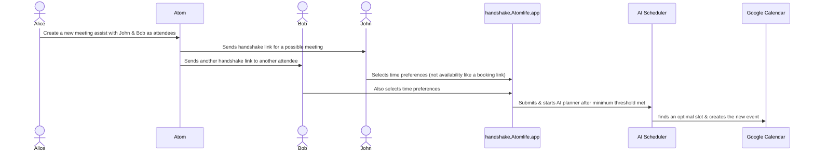

# Atom: Your Open-Source AI Assistant for Enhanced Productivity

Atom is a powerful and flexible open-source AI assistant designed to streamline your workflow, intelligently manage your schedule, automate research, and organize your information. Take control of your productivity with an assistant that you can host yourself, ensuring privacy and customization.

## Why Choose Atom?
*   **Empower Your Productivity:** Let Atom handle the tedious tasks of scheduling, note-taking, and information gathering so you can focus on what matters most.
*   **Open Source & Transparent:** Built with transparency in mind, Atom's open-source nature means you have full visibility into its operations. No black boxes.
*   **Self-Hosted for Privacy & Control:** Host Atom on your own infrastructure for maximum privacy and control over your data and how the assistant operates.
*   **Highly Customizable:** Adapt Atom to your specific needs. Its modular design and open codebase allow for extensive customization and integration possibilities.
*   **Intelligent Automation:** Leverage AI for smart scheduling that considers your preferences, automated event templating, and efficient research capabilities.
*   **Seamless Integrations:** Connect Atom with your favorite tools like Google Calendar, Notion, Slack, Zoom, and more to create a unified productivity hub.

## Table of Contents
- [Why Choose Atom?](#why-choose-atom)
- [Example Use Cases](#example-use-cases)
- [Documentation](#documentation)
- [Features](#features)
  - [Smart Scheduling & Time Management](#smart-scheduling--time-management)
  - [Integrated Note-Taking & Research](#integrated-note-taking--research)
- [Core Agent Capabilities & Commands](#core-agent-capabilities--commands)
- [Configuration (Environment Variables)](#configuration-environment-variables)
- [Diagram](#diagram)
  - [Meeting Assist](#meeting-assist)
- [Deployment Options](#deployment-options)
  - [Local Docker Compose](#local-docker-compose)
  - [AWS Cloud Deployment (Self-Hosted)](#aws-cloud-deployment-self-hosted)
- [Support the Project](#support-the-project)
- [Contributing](#contributing)

## Example Use Cases
Tired of juggling multiple apps and struggling to stay organized? Atom is here to help you reclaim your focus and boost your productivity. Here are a few ways Atom can simplify your work and personal life:

*   **Effortless Meeting Coordination:** "Find a time next week for a 30-minute meeting with Sarah and John, prioritizing Wednesday afternoon." Atom will check everyone's availability (integrating with their calendars if permitted) and propose optimal times.
*   **Smart Task Management:** "Remind me to draft the project proposal by end of day tomorrow and block out 2 hours for it in the morning." Atom can create reminders and automatically schedule focused work time.
*   **Automated Information Gathering:** "Research the latest trends in AI-powered personal assistants and summarize the key findings in a Notion document." Atom's research agents can browse, collect, and synthesize information, delivering it directly to your knowledge base.
*   **Voice-Powered Note-Taking:** While commuting, you can say: "Atom, take an audio note: Idea for marketing campaign - focus on social media engagement and influencer collaborations." Atom will transcribe the audio and save it to Notion.
*   **Proactive Schedule Optimization:** With Autopilot, Atom can learn your work patterns and preferences. "My mornings are for deep work. Keep them as free of meetings as possible." Atom will then intelligently schedule new events accordingly.
*   **Quickly Access Information:** "What was the outcome of the Project Phoenix meeting last month?" Atom can search your linked Notion notes and relevant event details to provide you with the context you need.
*   **Stay on Top of Your Day:** "What's on my agenda for today?" or "Do I have any free time this afternoon for a quick call?"

## Documentation

Atom provides several resources to help you get started and make the most of its features:

*   **Local Deployment (Docker Compose):** For detailed instructions on setting up and running Atom locally using Docker Compose, please see the [Local Docker Deployment Guide](./atomic-docker/README.md).
*   **AWS Cloud Deployment:** To deploy Atom to your own AWS account for a scalable solution, refer to the [AWS Cloud Deployment Guide](./deployment/aws/README.md).
*   **Technical Documentation:** Additional technical details, API guides, and development logs can be found in the [atomic-docker/docs/](./atomic-docker/docs/) directory.
*   **Configuration Details:** For a comprehensive list of environment variables, consult the `.env.example` file in the `atomic-docker/project/` directory and the setup sections within the deployment guides mentioned above.

## Features

### Smart Scheduling & Time Management
Atom revolutionizes how you manage your time with a suite of AI-powered scheduling tools:
*   **AI-Powered Event Matching (Semantic Search & Templating):** Atom uses **LanceDB** and a two-stage AI process to understand your events. It matches new or queried events with past ones, turning your history into smart templates. This includes AI-driven query enhancement and accurate categorization of events, applying attributes like duration, priority, and color automatically.
*   **Automated Event Tagging:** Events are intelligently categorized and tagged by AI, streamlining creation and ensuring consistent handling of similar events based on learned patterns.
*   **Flexible Meetings:** Easily schedule recurring 1:1s or ad-hoc team meetings that respect everyone's calendar and time preferences. Non-Atom users can also participate by syncing calendars and submitting preferences.
*   **Autopilot Planning:** Let Atom's AI planner manage your schedule proactively. It can search for and apply features to new events based on your trained templates, typically running before your workday begins.
*   **Customizable Time Preferences:** Define when you prefer flexible meetings and other modifiable events to occur.
*   **Trainable Event Templates:** Teach Atom how to handle different types of events. Customize attributes like transparency, buffer times, priority, modifiable nature, tags, color, duration, and break types. You can also "untrain" events.
*   **Automated Time Blocking:** Atom can automatically block time for tasks with daily or weekly deadlines, intelligently placing them on your calendar based on priority and your requirements (soft or hard deadlines).
*   **Event Priority & Rating:** Set priorities for modifiable events to influence their placement on your calendar. Rate past events to provide feedback on your productivity, which Atom considers for future scheduling.
*   **Configurable Smart Tags:** Apply specific settings to tags, dictating how Atom applies features or attributes to new events that are either AI-tagged or manually tagged.

### Integrated Note-Taking & Research
Keep your knowledge organized and accessible:
*   **Note-Taking (Notion & Audio):** Create text and audio notes directly in Notion. Audio notes are automatically transcribed using Deepgram. Your notes can be searched, updated, and linked to tasks or calendar events within Notion.
*   **Multi-Agent Research System (Notion & LanceDB):** Initiate research projects based on simple queries. A lead AI agent decomposes your query into sub-tasks, assigning them to specialized sub-agents. These agents perform research (e.g., web searches, internal Notion searches using LanceDB for vector-based information retrieval) and log their findings in a dedicated Notion database. The lead agent then synthesizes this information into a comprehensive final report in Notion.

## Core Agent Capabilities & Commands

The Atom Agent understands a variety of commands to interact with your integrated services. Commands are typically issued in a chat interface with the agent.

Atom provides a rich set of commands to manage your productivity. You can interact with Atom to:
*   **Manage your calendar:** List, create, and modify events across Google Calendar and Microsoft Teams.
*   **Handle CRM tasks:** Create and retrieve contacts in HubSpot.
*   **Communicate via Slack:** Send messages and list channels.
*   **Manage video meetings:** List and get details for Zoom and Google Meet events.
*   **Process payments:** Interact with Stripe to list payments.
*   **Handle accounting:** Work with QuickBooks Online to manage invoices.
*   **Take notes and conduct research:** Create notes in Notion, initiate multi-agent research projects, and process research queues.
*   And much more, including general commands like `help`.

For a more detailed list of commands and their specific syntax, please refer to the agent's `help` command or explore the agent's capabilities through interaction.

## Configuration (Environment Variables)

The Atom Agent uses environment variables for its configuration and to connect to various third-party services.

Atom requires various environment variables to be set for full functionality, including API keys for OpenAI, Notion, Deepgram, and credentials for integrated services like Google Calendar, HubSpot, Slack, Zoom, Microsoft Teams, Stripe, and QuickBooks Online. You will also need to configure settings for LanceDB storage and web search APIs.

For a comprehensive list of all environment variables and their setup, please refer to the `.env.example` file in the `atomic-docker/project/` directory and the detailed setup instructions in the deployment guides for [Local Docker Compose](./atomic-docker/README.md) and [AWS Cloud Deployment](./deployment/aws/README.md).

## Diagram

### Meeting Assist

## Deployment Options

This project offers multiple ways to deploy and run the Atom application stack.

### Local Docker Compose

For local development, testing, and self-hosting on a single machine, the project can be run using Docker Compose. This method utilizes the services defined in the `atomic-docker/` directory.

-   **Setup and Instructions:** See the detailed guide in [atomic-docker/README.md](./atomic-docker/README.md).

### AWS Cloud Deployment (Self-Hosted)

For a scalable and robust cloud environment, you can deploy the entire application stack to your own AWS account. This deployment is managed by the AWS Cloud Development Kit (CDK) and provisions all necessary infrastructure, including managed services for databases, messaging, and search where appropriate.

-   **Features:** Deploys core application services, Optaplanner, a new `python-agent` service (for notes and research), and utilizes AWS S3, Amazon EFS (for LanceDB vector stores), and Amazon MSK Serverless. Amazon OpenSearch Service is no longer used.

-   **Detailed Guide:** For prerequisites, setup instructions, deployment steps, and management, please refer to the comprehensive [AWS Deployment Guide](./deployment/aws/README.md).

## Support the Project
- I'm spending 100% of my work time on this project
- Star this repository, so I can start an Open Collective to support this project
- In process of setting up Github Sponsors
- Follow me on Twitter: https://twitter.com/rish1_2
- Used Atom? write a review or let me know!

## Contributing

1. Fork this repository and clone the fork to your machine
2. Create a branch (`git checkout -b my-new-feature`)
3. Implement a new feature or fix a bug and add some tests or proof of fix
4. Commit your changes (`git commit -am 'Added a new feature'`)
5. Push the branch to your fork on GitHub (`git push origin my-new-feature`)
6. Create new Pull Request from your fork
